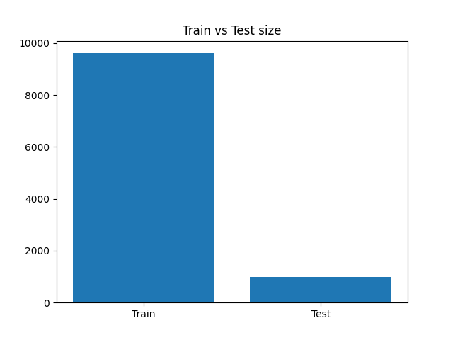
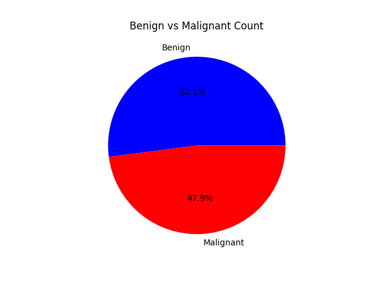
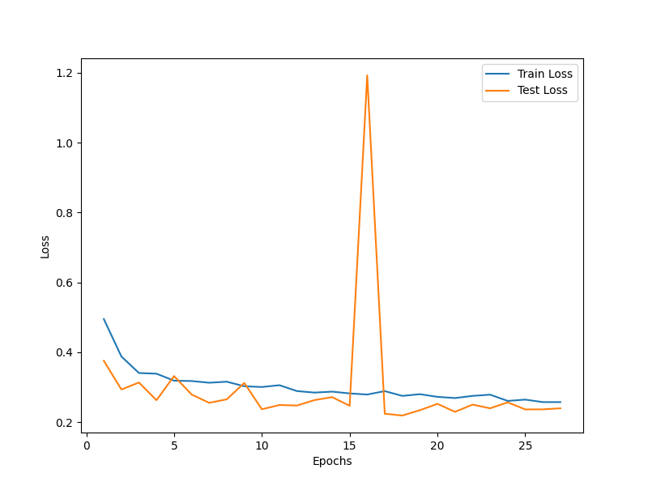
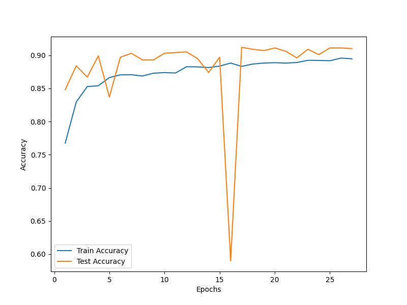
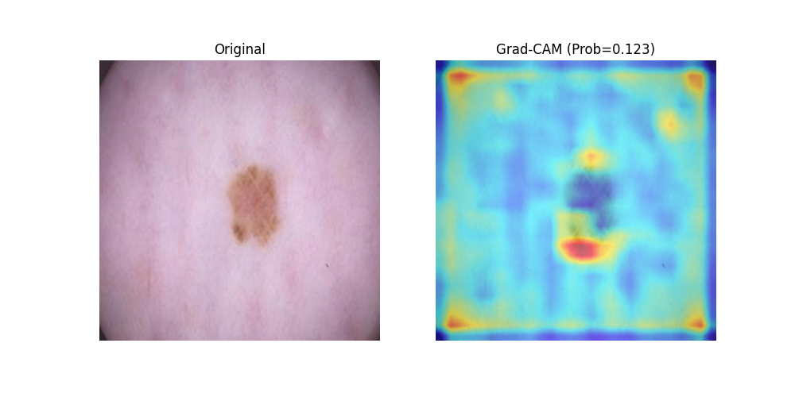
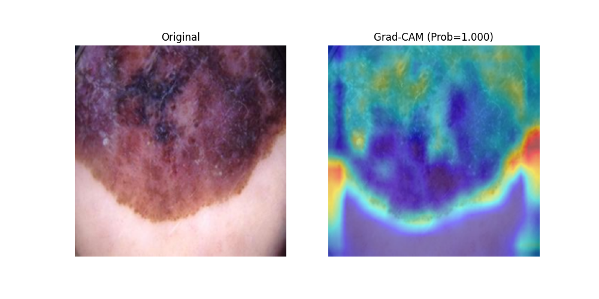

# Skin Cancer Detection

FastAPI service for skin cancer classification using an exported ONNX model. The project includes a small inference API, training and evaluation visuals, and Grad-CAM examples that help interpret model predictions on benign and malignant cases.

## Achievements

The trained model achieved 90% accuracy, 89% recall, and 92% F1-score on the evaluation set.

## Dataset

This project uses the Melanoma Skin Cancer Dataset of 10000 Images from Kaggle. It contains dermoscopic skin images labeled for melanoma-related classification tasks and was used to train and evaluate the model in this repository.

Kaggle dataset link: https://www.kaggle.com/datasets/hasnainjaved/melanoma-skin-cancer-dataset-of-10000-images

## What’s inside

- `app.py` exposes a FastAPI app with health, info, and prediction endpoints.
- `utils.py` loads `model/model.onnx`, preprocesses images, and runs inference.
- `Images/` contains dataset, training, and evaluation plots.
- `Images/grad-cam/` contains Grad-CAM visualizations for benign and malignant examples.
- `Images/test-images/` contains sample dermoscopic images used for testing.

## Model Workflow

The API accepts an uploaded image, resizes and normalizes it to match the model input, and runs it through the ONNX runtime session. The returned response includes the raw logit, malignant probability, predicted class, and a human-readable label.

The prediction threshold is set to `0.4`, so probabilities at or above that value are classified as malignant.

## Repository Structure

```text
.
├── app.py
├── utils.py
├── model/
│   ├── best_model.pth
│   └── model.onnx
├── Images/
│   ├── accuracy_plot.png
│   ├── dataset_size.png
│   ├── loss_plot.png
│   ├── patient-disease_count.png
│   ├── grad-cam/
│   │   ├── benign/
│   │   └── Malignant/
│   └── test-images/
└── notebooks/
		└── skin-cancer-detection.ipynb
```

## Setup

Install the dependencies with pip:

```bash
pip install -r requirements.txt
```

## Run the API

Start the server with Uvicorn:

```bash
uvicorn app:app --reload
```

Once the server is running, open the interactive docs at `http://127.0.0.1:8000/docs`.

## API Endpoints

- `GET /` returns a short description and the available endpoints.
- `GET /health` returns a simple health check response.
- `POST /predict` accepts an uploaded image file and returns the model prediction.

### Prediction example

```bash
curl -X POST "http://127.0.0.1:8000/predict" \
	-F "file=@Images/test-images/melanoma_10121-malignant.jpg"
```

Example response:

```json
{
	"Logit": 1.2345,
	"Probability of malignant": 0.7742,
	"Predicted Class": 1,
	"Predicted Label": "Malignant"
}
```

## Results and Visualizations

The plots below summarize the dataset and training behavior.

### Dataset and training plots









### Grad-CAM examples

The Grad-CAM figures highlight regions that most influenced the model’s prediction.

#### Benign examples



.png)

#### Malignant examples



.png)

## Notes

- The ONNX model is loaded from `model/model.onnx` at runtime.
- Input images are resized to `224 x 224` and normalized using the statistics defined in `utils.py`.
- If you regenerate the plots or Grad-CAM outputs, keep the filenames aligned with the links in this README so the images render correctly.
